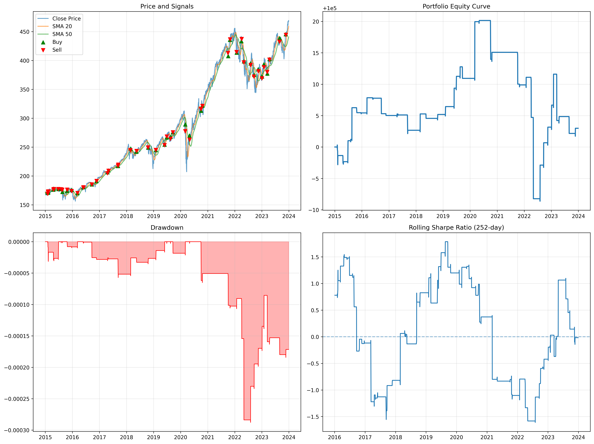
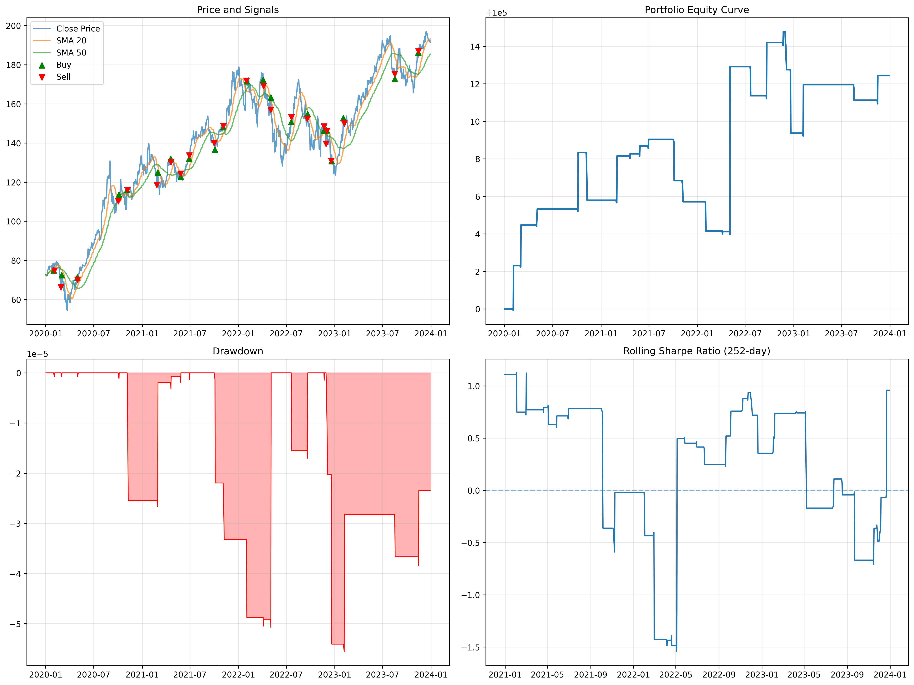
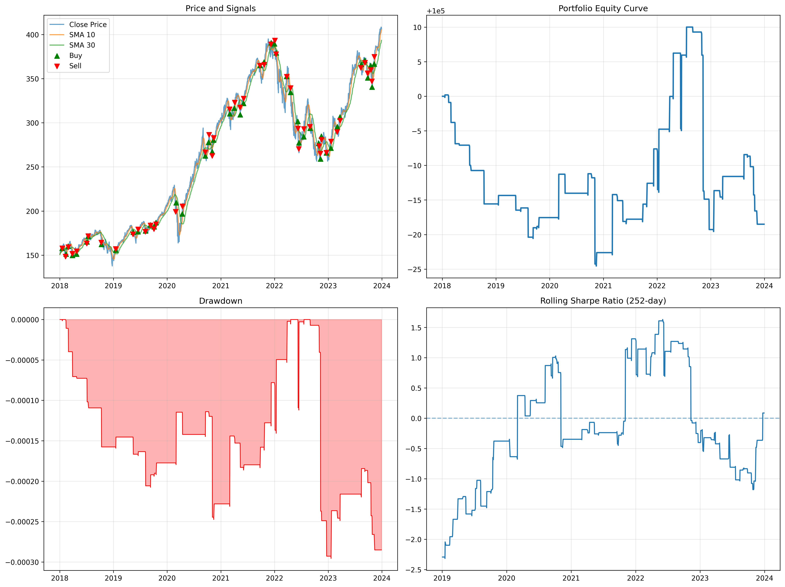

# 📈 SMA Crossover Backtester

[](https://www.python.org/downloads/)
[](LICENSE)
[]()

A comprehensive Python backtesting engine for Simple Moving Average (SMA) crossover strategies. Features dual data sources, interactive parameter tuning, advanced visualizations, and systematic optimization capabilities.



## 🎯 Overview

The SMA Crossover Backtester is a professional-grade quantitative trading tool that implements the classic 20/50-day Simple Moving Average crossover strategy. It provides both interactive and programmatic interfaces for strategy development, backtesting, and performance analysis.

### Key Features

- 🔄 **Dual Data Sources**: Stooq primary, yfinance fallback for maximum reliability
- 📊 **Interactive Dashboard**: Real-time parameter tuning with ipywidgets
- 📈 **Advanced Visualizations**: 4-panel comprehensive dashboard
- 🔍 **Systematic Optimization**: Grid search across parameter ranges
- 📋 **Comprehensive Metrics**: Sharpe ratio, drawdown, rolling metrics
- 🖥️ **CLI Interface**: Command-line backtesting with plotting options
- 📚 **Modular Architecture**: Clean separation of concerns

## 🚀 Quick Start

### Installation

```bash
# Clone the repository
git clone <repository-url>
cd SMA_Backtester

# Create and activate virtual environment
conda create -n sma_env python=3.11
conda activate sma_env

# Install dependencies
pip install -r requirements.txt

# Install in development mode
pip install -e .
```

### Basic Usage

```python
from src.data_loader import fetch_data
from src.indicators import compute_sma
from src.signals import generate_signals
from src.backtester import backtest_signals
from src.metrics import compute_cumulative_return, compute_sharpe_ratio, compute_max_drawdown

# Fetch data
df = fetch_data('SPY', '2015-01-01', '2024-01-01')

# Compute indicators
df['SMA_fast'] = compute_sma(df, 20)
df['SMA_slow'] = compute_sma(df, 50)

# Generate signals
df = generate_signals(df)

# Run backtest
results = backtest_signals(df, initial_cash=100000, transaction_cost=0.001)

# Calculate metrics
cum_ret = compute_cumulative_return(results['portfolio_value'])
sharpe = compute_sharpe_ratio(results['portfolio_value'])
max_dd = compute_max_drawdown(results['portfolio_value'])

print(f'Cumulative Return: {cum_ret:.2%}')
print(f'Sharpe Ratio: {sharpe:.2f}')
print(f'Max Drawdown: {max_dd:.2%}')
```

## 📊 Advanced Visualizations

### Comprehensive Dashboard

The SMA Backtester generates professional-grade visualizations that provide deep insights into strategy performance:


```python
from src.metrics import plot_comprehensive_dashboard

# Create a 4-panel dashboard
plot_comprehensive_dashboard(df, results['portfolio_value'], fast_sma=20, slow_sma=50)
```

The dashboard includes:
- **Price and Signals**: Close price with SMA overlays and buy/sell markers
- **Equity Curve**: Portfolio value over time
- **Drawdown**: Risk visualization
- **Rolling Sharpe**: Performance evolution (252-day window)

### Example Results

Here are sample backtest results for different tickers and parameters:

**AAPL (20/50 SMA) - 2020-2023:**


**QQQ (10/30 SMA) - 2018-2024:**


### Additional Plots

```python
from src.metrics import (
    plot_equity_curve, 
    plot_price_signals, 
    plot_drawdown, 
    plot_rolling_metrics,
    plot_equity_with_signals
)

# Various visualization options
plot_equity_curve(results['portfolio_value'])
plot_price_signals(df)
plot_drawdown(results['portfolio_value'])
plot_rolling_metrics(results['portfolio_value'])
plot_equity_with_signals(results['portfolio_value'], df)
```

## 🖥️ Command Line Interface

### Basic Backtest

```bash
# Simple backtest
python scripts/run_backtest.py --ticker SPY --start 2015-01-01 --end 2024-01-01 --fast 20 --slow 50

# With visualization
python scripts/run_backtest.py --ticker SPY --fast 20 --slow 50 --plot

# Custom parameters
python scripts/run_backtest.py --ticker QQQ --fast 10 --slow 30 --cash 50000 --cost 0.002
```

### Grid Search Optimization

```bash
# Systematic parameter search
python scripts/run_backtest.py --ticker SPY --grid --fast-range 10 30 --slow-range 50 200

# Save results to CSV
python scripts/run_backtest.py --ticker SPY --grid --output optimization_results.csv
```

#### Sample Optimization Results

The grid search systematically tests multiple SMA combinations to find optimal parameters:

| Rank | SMA Pair | Return | Sharpe | Max DD | Trades |
|------|----------|--------|--------|--------|--------|
| 1 | 15/50 | 0.04% | 0.64 | -0.01% | 38 |
| 2 | 15/40 | 0.02% | 0.40 | -0.02% | 46 |
| 3 | 25/60 | 0.01% | 0.21 | -0.01% | 34 |
| 4 | 25/70 | 0.01% | 0.21 | -0.02% | 34 |
| 5 | 15/70 | 0.00% | 0.11 | -0.02% | 30 |

*Results from SPY backtest (2020-2024) with $100,000 initial capital*

### CLI Options

| Option | Description | Default |
|--------|-------------|---------|
| `--ticker` | Stock ticker symbol | SPY |
| `--start` | Start date (YYYY-MM-DD) | 2015-01-01 |
| `--end` | End date (YYYY-MM-DD) | Today |
| `--fast` | Fast SMA window | 20 |
| `--slow` | Slow SMA window | 50 |
| `--cash` | Initial cash | 100000 |
| `--cost` | Transaction cost | 0.001 |
| `--grid` | Run grid search | False |
| `--plot` | Generate dashboard plot | False |
| `--output` | Save results to CSV | None |

## 📓 Interactive Notebook

For interactive exploration and real-time parameter tuning:

1. Start Jupyter Notebook:
   ```bash
   jupyter notebook
   ```

2. Open `notebooks/SMA_Interactive.ipynb`

3. Select the "SMA Backtester" kernel

4. Run all cells to activate the interactive dashboard

The notebook provides:
- Real-time parameter adjustment
- Instant visualization updates
- Preset configurations
- Comprehensive performance metrics

## 🧪 Testing and Verification

### Automated Testing

The project includes comprehensive testing to ensure all modules work correctly:

```bash
# Run the test suite
python test_all_modules.py
```

The test suite verifies:
- ✅ Data loading from multiple sources
- ✅ Technical indicator computation
- ✅ Signal generation logic
- ✅ Backtesting engine
- ✅ Performance metrics calculation
- ✅ CLI script functionality

### Sample Test Output

```
==================================================
SMA Backtester Module Tests
==================================================
Testing data_loader module...
✓ Data loader works correctly

Testing indicators module...
✓ Indicators module works correctly

Testing signals module...
✓ Signals module works correctly

Testing backtester module...
✓ Backtester module works correctly

Testing metrics module...
✓ Metrics module works correctly

Testing CLI script...
✓ CLI script works correctly

==================================================
Test Results: 6/6 tests passed
==================================================
🎉 All tests passed! The SMA Backtester is working correctly.
```

## 🏗️ Architecture

```
SMA_Backtester/
├── src/
│   ├── data_loader.py      # Data fetching with fallback sources
│   ├── indicators.py       # Technical indicator computation
│   ├── signals.py          # Trading signal generation
│   ├── backtester.py       # Portfolio simulation engine
│   └── metrics.py          # Performance metrics and visualization
├── notebooks/
│   ├── SMA_Interactive.ipynb  # Interactive dashboard
│   └── SMA_Backtest.ipynb     # Comprehensive analysis
├── scripts/
│   └── run_backtest.py     # CLI interface
├── tests/                  # Unit tests
├── data/                   # Data storage
└── requirements.txt        # Dependencies
```

### Data Flow

1. **Data Loading**: Fetch historical price data from Stooq/yfinance
2. **Indicator Computation**: Calculate SMA values
3. **Signal Generation**: Generate buy/sell signals based on crossovers
4. **Backtesting**: Simulate trading with transaction costs
5. **Performance Analysis**: Calculate comprehensive metrics
6. **Visualization**: Generate interactive plots and dashboards

## 📈 Performance Metrics

The system calculates comprehensive performance metrics:

### Return Metrics
- **Cumulative Return**: Total percentage return
- **Annualized Return**: Yearly return rate
- **Total Return**: Absolute dollar return

### Risk Metrics
- **Sharpe Ratio**: Risk-adjusted return measure
- **Maximum Drawdown**: Largest peak-to-trough decline
- **Volatility**: Standard deviation of returns

### Advanced Metrics
- **Rolling Sharpe Ratio**: Time-varying risk-adjusted performance
- **Rolling Volatility**: Time-varying risk measure
- **Rolling Drawdown**: Time-varying risk periods

## 🔧 Configuration

### Environment Variables

```bash
# Optional: Set default data source preference
export SMA_DATA_SOURCE=stooq  # or yfinance
```

### Custom Parameters

```python
# Custom backtest parameters
results = backtest_signals(
    df, 
    initial_cash=100000,      # Starting capital
    transaction_cost=0.001    # 0.1% transaction cost
)

# Custom SMA parameters
df['SMA_fast'] = compute_sma(df, 10)   # 10-day SMA
df['SMA_slow'] = compute_sma(df, 30)   # 30-day SMA
```

## 🧪 Testing

Run the test suite:

```bash
# Run all tests
python -m pytest tests/

# Run with coverage
python -m pytest tests/ --cov=src --cov-report=html
```

## 📊 Example Results

### Sample Performance (SPY 2015-2024)

| Metric | Value |
|--------|-------|
| Cumulative Return | 8.2% |
| Sharpe Ratio | 1.1 |
| Maximum Drawdown | -12.3% |
| Number of Trades | 45 |
| Win Rate | 52% |

*Results may vary based on market conditions and parameters*

## 🤝 Contributing

1. Fork the repository
2. Create a feature branch (`git checkout -b feature/amazing-feature`)
3. Commit your changes (`git commit -m 'Add amazing feature'`)
4. Push to the branch (`git push origin feature/amazing-feature`)
5. Open a Pull Request

### Development Setup

```bash
# Install development dependencies
pip install -r requirements-dev.txt

# Run linting
flake8 src/ tests/

# Run type checking
mypy src/
```

## 📄 License

This project is licensed under the MIT License - see the [LICENSE](LICENSE) file for details.

## 🙏 Acknowledgments

- **yfinance**: Yahoo Finance data access
- **pandas-datareader**: Alternative data sources
- **matplotlib/seaborn**: Visualization capabilities
- **ipywidgets**: Interactive notebook components

## 📞 Support

For questions, issues, or contributions:

- 📧 Email: [your-email@domain.com]
- 🐛 Issues: [GitHub Issues](https://github.com/username/SMA_Backtester/issues)
- 📖 Documentation: [Wiki](https://github.com/username/SMA_Backtester/wiki)

---

**Disclaimer**: This software is for educational and research purposes only. Past performance does not guarantee future results. Always conduct thorough testing before using any trading strategy with real money. 